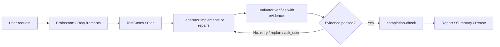

# AutoMind

```text
    /\         _        __  __ _           _
   /  \  _   _| |_ ___ |  \/  (_)_ __   __| |
  / /\ \  | | | __/ _ \| |\/| | | '_ \ / _` |
 / ____ \ |_| | || (_) | |  | | | | | | (_| |
/_/    \_\__,_|\__\___/|_|  |_|_|_| |_|\__,_|
```

[中文](README.zh-CN.md) | English

**AutoMind is an evidence-driven harness loop for coding agents.**

It helps Codex, Claude Code, Trae, and other coding agents turn a request into
requirements, test cases, code changes, real verification evidence, repair
loops, reports, and reusable project knowledge.

> Evidence beats vibes. Give coding agents a harness, not just a prompt.



## Why AutoMind

Modern coding agents are good at editing code, but they often stop too early:
requirements are vague, tests are weak, environment blockers are misclassified,
UI flows are not really exercised, and “done” can mean “the model feels done”.

AutoMind adds a lightweight but strict engineering loop around the agent:

- **Plan before coding** — expand the request into `Brainstorm.md`,
  `Requirements.md`, `TestCases.md`, and `Plan.md`.
- **Gate phase transitions** — use `workflow-check`, `phase-gate`, and JSON
  sidecars to keep planning, implementation, and verification aligned.
- **Verify with evidence** — prefer real build/test/device/UI evidence over
  model confidence.
- **Repair until proven** — route failures through `evaluation.json` back to the
  Generator for repair, then re-verify.
- **Prevent false finish** — require `completion-check` before claiming done.
- **Learn from every run** — write summaries, reuse indexes, successful paths,
  and avoid paths so future tasks can reuse proven commands and lessons.

AutoMind does **not** replace Codex, Claude Code, Trae, project-native tests, or
platform SDKs. It gives them a disciplined execution protocol.

## Install

```bash
curl -fsSL https://raw.githubusercontent.com/leishuai/Automind/main/install-curl.sh | bash
```

The installer:

- installs a git-free AutoMind runtime at `~/.automind/automind` by default;
- creates the CLI wrapper at `~/.local/bin/automind` by default;
- runs initialization;
- installs the AutoMind skill and `/automind` command for supported coding-agent
  user folders when available.

If `~/.local/bin` is not on `PATH`, the installer prints the line to add.

Verify the install:

```bash
automind smoke offline-demo
```

The smoke test requires no device. It creates `.automind/tasks/offline_demo_smoke/`
and verifies command evidence, `evaluation.json`, workflow/completion gates,
summary, and record checks.

### Update

Install and update use the same command:

```bash
curl -fsSL https://raw.githubusercontent.com/leishuai/Automind/main/install-curl.sh | bash
```

The bootstrap updates an installer cache, re-syncs the git-free runtime into
`~/.automind/automind`, and reinstalls agent skill/command files. Local task data
and reuse memory are preserved because `.automind/tasks/`, `.automind/summary/`,
`dist/`, and `.venv-*/` are excluded from destructive runtime sync.

Pin a version or branch:

```bash
curl -fsSL https://raw.githubusercontent.com/leishuai/Automind/main/install-curl.sh | AUTOMIND_BRANCH=v0.1.0 bash
```

## Use AutoMind

### In Codex / Claude Code / Trae

After installation, restart or reload the coding agent, then run from your target
project:

```text
/automind Fix the login crash and verify it
```

This is the recommended current-session flow. The host coding agent remains the
Planner/Generator, while AutoMind provides scaffolding, gates, verification
helpers, durable artifacts, and loop-control signals. It does **not** start a
separate agent session by default.

`/automind ask ...` is equivalent to `/automind ...` in current-session mode.
Use detached/background variants only when you explicitly want a separate CLI
agent process.

### In a terminal

Run from the target project root so task artifacts are created in that project:

```bash
cd /path/to/your-project
automind
```

Bare `automind` opens the interactive shell.

To let AutoMind own a separate CLI-driven loop:

```bash
automind ask "Fix the login crash and verify it"
```

To resume an existing task:

```bash
automind resume <task-code>
automind continue [task-code]
```

Runtime and workspace are intentionally separate: the installed runtime normally
lives under `~/.automind/automind`, while task artifacts live under the target
workspace at `.automind/tasks/<task-code>/`. If the shell is not in the target
project root, set:

```bash
AUTOMIND_WORKSPACE_ROOT=/path/to/project automind <command>
```

## What AutoMind produces

Each task gets a workspace under:

```text
.automind/tasks/<task-code>/
```

Important files:

| File | Purpose |
|---|---|
| `Brainstorm.md` | Intent expansion, assumptions, risks, options, recommendation |
| `Requirements.md` | Requirements and acceptance criteria |
| `TestCases.md` | Concrete verification runbooks |
| `Plan.md` | Implementation and verification plan/checklists |
| `Delivery.md` | What Generator changed and how to verify it |
| `Validation.md` | Human-readable verification history and evidence |
| `evaluation.json` | Machine-readable result, failed checks, evidence, and next action |
| `VerificationLedger.json` / `completion-report.json` | Completion coverage and final gate output |
| `Report.html` | User-facing review report with key evidence per testcase |
| `summary.md` / `Reuse.md` | Reusable lessons, successful paths, avoid paths |

Most users inspect a task with:

```bash
automind status <task-code>
automind report <task-code>
automind summary <task-code>
```

## Core workflow

```text
User request
  -> Brainstorm.md
  -> Requirements.md
  -> TestCases.md
  -> Plan.md
  -> workflow.json + phase JSON sidecars
  -> pre-implementation review / ask_user when needed
  -> workflow-check
  -> Generator -> Delivery.md
  -> Evaluator -> Validation.md + evaluation.json
  -> retry Generator / replan / ask_user / stop / finish
  -> completion-check
  -> Report.html + summary/reuse
```

Key rules:

1. **No coding before the plan is coherent.** `workflow-check` must pass before
   Build.
2. **No verification without delivery context.** `Delivery.md` is required before
   final Verify.
3. **No finish without evidence.** `completion-check` must pass before the user
   is told the task is complete.
4. **Evaluator stays independent.** Model Evaluator runs should use a context
   pack and avoid inheriting Generator hidden context.
5. **Failures route forward.** Build/test/device/UI failures should become
   `retry_generator`, `replan`, `ask_user`, or a real stop condition, not vague
   chat advice.

For the full workflow contract, see [`docs/workflow.md`](docs/workflow.md).

## Real verification and UI operation

AutoMind treats runtime verification as first-class when a task needs it:

- project-native build/test commands;
- generic `script-command` verification;
- Android preflight, `adb`/uiautomator-style probe flows, screenshots, UI
  hierarchy, logs, action traces, and post-action assertions;
- iOS preflight, XCUITest/probe-flow/action-plan materialization, screenshots,
  logs, `.xcresult`, and app-alive evidence;
- Web probe-flow / project-native E2E commands when available;
- deterministic visual inspection and optional AI visual review when screenshot
  evidence exists.

For UI tasks, a pass requires executed actions plus satisfied assertions or
postChecks. A screenshot path alone is not enough.

Sensitive or destructive actions require explicit user authorization: signing or
keychain changes, device trust, account login, payment, delete/reset/uninstall,
external upload, production-impacting actions, sudo/system services, and
ambiguous privacy/terms consent.

## Common commands

```bash
# Start / resume
automind                         # interactive shell
automind ask "Fix login crash"    # CLI-owned loop
automind list                    # list tasks
automind resume <task-code>      # resume persisted task
automind continue [task-code]    # print next-step instruction
automind answer <task-code> --text "..."

# Inspect / report
automind status <task-code>
automind tui <task-code>
automind notifications <task-code>
automind doctor <task-code>
automind report <task-code>
automind logs [task-code]

# Gates
automind workflow-check <task-code>
automind phase-gate <task-code> auto
automind completion-check <task-code>
automind record-check <task-code>

# Verification helpers
automind script-command <task-code> [iteration]
automind quality-check <task-code> [iteration] --merge
automind dependency-check [task-code] [iteration]
automind setup-automation-tools [android|ios|visual|all]
automind ui-evidence-check <task-code> [iteration]
automind visual-inspect <task-code> --image PATH [--baseline PATH]

# Summary / reuse
automind summary <task-code>
automind summary-refine <task-code> [agent]
automind reuse [limit]
automind improve-suggestions [--limit N]
```

Run `automind help` for the full command list.

## Examples

Start here:

- [`examples/README.md`](examples/README.md)
- [`examples/offline-script-demo/`](examples/offline-script-demo/)
- [`examples/probe-flows/`](examples/probe-flows/)

Best first run:

```bash
automind smoke offline-demo
automind status offline_demo_smoke
automind summary offline_demo_smoke
automind record-check offline_demo_smoke
```

Platform demos under [`demos/`](demos/) may require Android/iOS tooling,
simulators, or devices.

## Dependencies and safety

Basic install requires:

- `bash` or a compatible shell;
- `git`;
- `python3`.

The public installer does **not** install or modify:

- Xcode, Android Studio, Android SDK/platform-tools, or `adb`;
- iOS signing certificates, keychains, provisioning profiles, or Team settings;
- device trust settings, privileged services, or target app data;
- browsers/drivers, OCR engines, Docker/database services, private registry
  credentials, or arbitrary target-project dependencies.

When mobile or visual verification needs low-risk Python helper packages,
AutoMind may create local virtualenvs in the target workspace:

```bash
automind setup-automation-tools android
automind setup-automation-tools ios
automind setup-automation-tools visual
```

Those commands use version-bounded specs in `requirements/*.txt` and create
project-local `.venv-android-tools/`, `.venv-ios-tools/`, or
`.venv-visual-tools/`. They do not install system SDKs, signing material, device
trust settings, or privileged services.

Environment, device, signing, and permission failures are blockers, not
product-code failures.

## Troubleshooting

### `automind: command not found`

Add the wrapper directory to your shell profile, usually:

```bash
export PATH="$HOME/.local/bin:$PATH"
```

Then restart the shell and run `automind help`.

### `/automind` is not visible

Restart or reload the coding agent. Confirm the relevant user-level files exist,
for example `~/.codex/commands/automind.md` and
`~/.codex/skills/automind-skill` for Codex.

### Mobile tooling is missing

Install the required platform tooling manually and rerun preflight. AutoMind can
create Python helper virtualenvs, but it does not install Xcode, Android Studio,
SDKs, signing assets, or device trust settings.

### The loop keeps failing

Run:

```bash
automind status <task-code>
automind workflow-check <task-code>
automind completion-check <task-code>
automind doctor <task-code>
```

If the same failure repeats, AutoMind may keep giving the model repair attempts;
use `replan` when evidence shows the strategy or validation target is wrong.

### The agent says done but completion fails

Trust `completion-check`. Add missing evidence, fix failed `TC-*`, cover missing
`AC-*`, or repair the implementation before claiming completion.

## Repository layout

```text
.
├── automind.sh        # CLI entry point used by the wrapper
├── install-curl.sh    # public one-line installer bootstrap
├── install.sh         # runtime installer
├── orchestrator/      # loop engine, runtime state, gates, context packs
├── scripts/           # execution/evidence adapters and export helpers
├── requirements/      # optional mobile/visual helper constraints
├── docs/              # workflow and references
├── schemas/           # machine-readable contracts
├── templates/         # planner/generator/evaluator prompts
├── examples/          # public-safe starter examples
├── demos/             # small platform demos
└── summaries/         # curated reusable technical lessons
```

Generated local runtime data lives under `.automind/` in the target workspace and
is ignored by git.

## Documentation

- [`automind_design.md`](automind_design.md) — product idea, design principles,
  and reliability mechanisms.
- [`docs/workflow.md`](docs/workflow.md) — canonical file protocol and loop
  semantics.
- [`docs/README.md`](docs/README.md) — documentation map.
- [`docs/references/installation-runtime.md`](docs/references/installation-runtime.md)
  — install paths, runtime root, workspace root, helper venvs, and coding-agent
  skill/command targets.
- [`docs/references/command-script-catalog.md`](docs/references/command-script-catalog.md)
  — command/script selection guide.
- [`docs/references/app-use-verification.md`](docs/references/app-use-verification.md)
  — app/UI operation and verification contract.
- [`docs/references/verification-flow.md`](docs/references/verification-flow.md)
  — cross-platform verification flow.
- [`docs/phase2-requirement.md`](docs/phase2-requirement.md) — model-driven
  planning/refinement.
- [`docs/phase3-verification.md`](docs/phase3-verification.md) — verification
  and Evaluator behavior.
- [`docs/phase4-summary.md`](docs/phase4-summary.md) — summary, reuse, and
  knowledge deposition.

## License

AutoMind is released under the MIT License. See [LICENSE](LICENSE).
