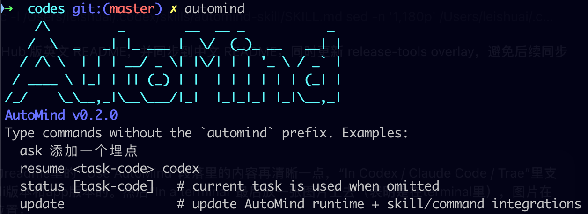

# AutoMind

[English](README.md) | 中文

**AutoMind 是面向 coding agent 的高度自动化、证据驱动 harness loop，具备真实 UI 操作、结构化恢复和自我进化的项目知识。**

它不替代 Codex、Claude Code、Trae 或其他 agent。它为这些 agent 提供一套有纪律的执行闭环，把一个请求转成需求、代码改动、真实的构建/测试/设备/UI 证据、retry/replan 决策、人类可读报告，以及可复用的项目知识。

> 给 coding agent 一个 harness，而不只是一个 prompt。

AutoMind 的重点：

- **高度自动化的 loop** —— 驱动 Planner → Generator → Evaluator → 修复/复验 循环，直到证据通过、需要用户输入，或证明遇到真实 blocker。
- **Loop over Prompt** —— 用 prompt 引导 agent，但靠 harness loop、门禁、证据和恢复策略来提升任务完成质量。
- **真实 UI 和设备操作** —— 把 App/UI 交互作为一等验证路径，包括 Android `adb`/`uiautomator2`、iOS XCUITest/probe-flow、Web probe-flow、截图、hierarchy、日志和动作后断言。启动/discovery 证据用于找路径；required runtime TC 需要执行到动作并满足 postCheck。App-use 路径探索、soft-failure 解释和 action-ladder 证据规则见 [`docs/references/app-use-verification.md`](docs/references/app-use-verification.md)。
- **文件协议保证连续性** —— 通过 Markdown artifact 加上机器可读 JSON 契约（如 `workflow.json`、phase sidecar、`evaluation.json`）保持各阶段对齐，减少规划、编码、验证之间的模型漂移。
- **结构化恢复** —— 用 `evaluation.json` 决定 retry、repair、replan、ask_user 还是 stop。
- **人类可读交接** —— 生成 `Report.html`，在每个 TC 行展示
  `Key Evidence`、可用截图、关键 runtime proof 链接，并在最终自然语言总结里告诉用户做完了什么、优先看哪些文件。
- **自我进化的知识** —— 写入 summary、reuse 索引、成功路径和 avoid 路径，让未来任务复用验证过的命令、环境和项目特定经验。
- **证据优于感觉** —— 优先使用确定性构建/测试/设备/UI 证据而非模型自信，并用 `completion-check` 阻止虚假完成。

## 工作原理

AutoMind 把每个任务作为一个自修复 harness loop 运行：

```text
Request
  -> Brainstorm：澄清意图、上下文、风险、方案选项和Home
  -> Requirements + TestCases + Plan
  -> workflow.json + phase sidecar 保持各阶段之间的契约
  -> 动代码前 review：auto-proceed，或 ask_user 确认方向/风险/设备选择
  -> workflow-check 把守编码就绪度并捕捉漂移
  -> Generator 生成或修复
  -> Evaluator 用构建/测试/设备/UI 证据验证
  -> 如果验证失败：evaluation.json 把任务路由回 Generator 修复
  -> Generator 修复，然后 Evaluator 复验
  -> 重复，直到证据通过、需要用户输入，或证明遇到真实 blocker
  -> completion-check 把守完成
  -> Report.html + 自然语言交接 + summary 沉淀为可复用的项目知识
```

关键行为是修复 loop：Evaluator 不只是说"失败"，而是记录证据和一个结构化的下一步动作，然后 AutoMind 把任务送回 Generator 修复并重新评估。模型仍然被信任去理解 UI 状态、选择路径、诊断失败；loop 负责判断证据是否足够强。对于 UI/runtime 任务，证明意味着执行到相关动作路径并满足 postCheck，而不只是启动 App 或截一张图。关键的连续性机制是文件协议：人类可读的 Markdown 解释意图，JSON 契约承载 phase 状态、覆盖率、下一步动作和门禁，让模型无法悄悄漂移到另一个需求或测试目标。在实现前，AutoMind 也把 plan review 显式化：低风险任务可以 auto-proceed，而方向不清、风险、授权、签名/设备选择或其他人类决策会变成一个 `ask_user` gate。

---

## 为什么用 AutoMind

现代 coding agent 很快，但真实工程工作常常在边缘崩溃：需求模糊、缺验收标准、测试过期、环境 blocker、验证薄弱、需要真实交互的 UI 流程，以及没有证据的"完成"声明。

AutoMind 帮助 agent：

- 把用户请求转成明确的 `Requirements.md`、`TestCases.md` 和 `Plan.md`；
- 通过任务 artifact 把实现和验证连接起来；
- 在任务需要 runtime 证据时操作真实 App 和 UI 流程；
- 优先确定性构建/测试/设备/UI 证据而非模型感觉；
- 基于结构化 `evaluation.json` 结果做 retry、repair、replan 或 ask_user；
- 用 `completion-check` 阻止虚假完成；
- 产出可审查的 `Report.html`、指向关键证据的自然语言交接，以及可复用 summary 和本地知识供未来使用。

设计理念见 [`automind_design.md`](automind_design.md)。

---

## 快速开始

使用 bootstrap 命令安装：

```bash
curl -fsSL https://raw.githubusercontent.com/leishuai/Automind/main/install-curl.sh | bash
```

安装脚本会：

- 默认把 AutoMind 安装到 `~/.automind/automind`（可用 `AUTOMIND_HOME=/custom/path` 覆盖）；
- 默认创建 CLI wrapper `~/.local/bin/automind`（可用 `AUTOMIND_BIN_DIR=/custom/bin` 覆盖）；
- 执行初始化；
- 在可用的用户级目录里为 Claude Code、Codex、Trae、Trae-CN 安装 AutoMind skill 和 `/automind` 命令。

Runtime 和 workspace 是分开的：AutoMind 本身安装在 `~/.automind/automind`，任务 artifact 写在目标项目 workspace 下（`<workspace>/.automind/tasks/<task-code>/`）。安装路径、runtime-root 规则、helper venv 和 coding-agent skill/command 目标见 [`docs/references/installation-runtime.md`](docs/references/installation-runtime.md)。

如果 `~/.local/bin` 不在 `PATH` 中，安装脚本会打印需要添加的那一行。

验证安装：

```bash
automind smoke offline-demo
```

这个不需要设备的 smoke test 会创建 `.automind/tasks/offline_demo_smoke/`，并验证基础 loop：命令证据、`evaluation.json`、completion check、summary 和 record check。

### 手动导出 skill 文件夹

安装器会在检测到用户级 agent 目录时，自动把 `automind-skill` 安装到 Claude Code、Codex、Trae、Trae-CN 等支持的 skill 目录。如果某个 agent 使用自定义 skill 目录，或者你想把 AutoMind skill 文件夹整体分享/导入给其他 agent，可以手动导出一份：

```bash
automind export-skill "$HOME/Downloads/automind-skill" --clean
```

然后把整个 `automind-skill` 文件夹导入或复制到对应 agent 的 skill 目录，例如 `~/.codex/skills/automind-skill`、`~/.claude/skills/automind-skill`、`~/.trae/skills/automind-skill`，或其它 agent 自己定义的 skills 目录。

这个导出的文件夹包含 AutoMind skill 指令、workflow 文档、prompt templates、schemas、examples、requirements 和 public-safe summary packs。它不是完整 runtime 的替代品；最佳体验仍然建议保留 full install，这样 agent 可以调用 `automind` helper、gate 和验证工具。

### 更新

更新到最新版本，推荐方式是：

```bash
automind update
```

或者，也可以重新跑同一条安装命令：

```bash
curl -fsSL https://raw.githubusercontent.com/leishuai/Automind/main/install-curl.sh | bash
```

安装和更新使用同一套底层流程：AutoMind 会拉取最新版本，刷新
`~/.automind/automind` 下的 git-free runtime，并重装各 agent 的
skill/command。你的本地数据会被保留——`.automind/tasks/` 和
`.automind/summary/` 下的任务产物和 reuse memory 不会被删除。可用
`AUTOMIND_BRANCH` 固定到指定版本：

```bash
curl -fsSL https://raw.githubusercontent.com/leishuai/Automind/main/install-curl.sh | AUTOMIND_BRANCH=0.2.0 bash
```

---

## 使用

### 在 Codex / Claude Code / Trae 中

AutoMind 支持 Codex、Claude Code、Trae、Trae-CN 的 CLI 版本，也支持它们的
App/桌面 coding-agent 环境；前提是该 agent 能加载用户级 skill 和/或 slash
command。

安装后，重启或 reload 你的 coding agent，打开目标项目，然后使用 slash command
入口：

```text
/automind Fix the login crash and verify it
```

`/automind` 是面向用户输入的 slash command；它会使用已安装的
`automind-skill` 协议。`automind-skill` 是 skill 名/文件夹名，不是 slash
command 名。如果 coding agent 支持直接选择或自然语言调用 skill，也可以这样写：

```text
Use automind-skill to fix the login crash and verify it
```

等价的 current-session 写法：

```text
/automind ask Fix the login crash and verify it
```

在 slash-command 模式下，AutoMind 让当前 coding-agent session 继续担任 Planner/Generator，在目标项目的 `.automind/tasks/<task-code>/` 下创建任务 artifact，运行 helper gate，并持续执行 Evaluator 验证 -> Generator 修复 -> Evaluator 复验，直到证据通过、需要用户输入，或遇到真实 blocker / 最大迭代保护。

它默认**不会**启动一个独立的 agent session。

### 在终端中

从目标项目根目录运行命令，这样 `.automind/tasks` 才会创建在该项目下：

```bash
cd /path/to/your-project
automind
```

裸 `automind` 打开交互式 shell。如果在当前 task 存在前就开始聊天，那个终端会获得自己的隐藏 TUI chat session，之后在同一 shell 里的 `ask ...` 可以复用那个 coding-agent session。

让 AutoMind 拥有一个独立的 CLI-driven loop：

```bash
automind ask "Fix the login crash and verify it"
```

未指定 agent 时，`ask`、`plan`、`resume` 使用 `auto` 选择：AutoMind 依次检查 `codex`、`claude`、Trae/Trae-CN（`traecli`），运行第一个通过 preflight 的 CLI。如果都不可用，它会报告每个检查过的 adapter 并建议改用 current-session 模式，而不是因为单个缺失的二进制就静默失败。Planner/Generator 的 approval-bypass 由任务级、记录在 `runtime-state.json` 的 `agentExecutionPolicy` 控制；缺该字段时兜底按 bypass 处理，这样非 new task、detached 脚本/resume/helper 命令，或没能触发 ask 的流程仍保持高自动化。TUI 不再就这个默认值提问；新任务把 `agentExecutionPolicy` 记为 `default_bypass` 用于审计，而 resume/helper 命令遵循已有策略或兜底。模型 Evaluator 运行对所有支持的 Coding Agent 都始终 fresh-isolated 且 bypass，以便采集 runtime/device/build 证据，避免 approval 卡死。敏感/破坏性/系统变更动作仍走 AutoMind 的 `ask_user` 防护。

如果 agent 的 shell 不在目标项目根目录，先设置 `AUTOMIND_WORKSPACE_ROOT=/path/to/project` 再运行 AutoMind 命令。Runtime 和 workspace 是分开的：已安装 runtime 通常在 `~/.automind/automind`（或 `$AUTOMIND_HOME`），而任务 artifact 在运行 AutoMind 的项目里。不要从旧日志照抄开发机绝对路径；helper 路径应从当前 runtime/workspace 或任务 `logs/iter-N/env.json` 解析。

Terminal TUI 示例：



---

## 选择模式

| 需求 | 使用 |
|---|---|
| 你已经在 Codex / Claude Code / Trae 里 | `/automind <请求>` |
| 你想要交互式终端 shell | `automind` |
| 你想让 AutoMind 拥有独立 CLI-driven loop | `automind ask "..."` |
| 你想从 slash 命令走 detached 模式 | `/automind detached ask <请求>` |
| 你只需要 current-session 工作的任务 artifact | `automind scaffold "..."` |
| 你需要继续之前的任务 | `automind resume <task-code>` 或 `automind continue [task-code]` |

`scaffold`、`workflow-contract`、`phase-gate`、`context-pack`、`completion-check`、`record-check` 这类高级 helper/gate 命令主要给 AutoMind skill、slash-command current-session flow、CI/回归 fixture 和调试使用。新用户通常不需要手动执行它们。

---

## 全自动模式（一站到底，不打断）

默认情况下，非琐碎的实现任务会在 pre-implementation review 处停一次，
确认范围、方案、风险和授权。如果你希望 AutoMind 自主跑完整个流程、
不被这一步打断，可以在初始请求里声明全自动：

```text
/automind 修复登录崩溃并验证，全自动
```

或：

```bash
automind ask "修复登录崩溃并验证，一站到底"
```

也可以在 pre-implementation `ask_user` 环节选择 `Full auto mode`，或直接回复
`全自动` / `full auto`。开启后，AutoMind 会把该决策记录到
`runtime-state.json`（`preImplementationReview.fullAuto=true`），并在后续安全的
completion gate 自动放行。

全自动不会跳过未事先授权的真正敏感/不可逆操作：账号/凭证登录、支付、
破坏性 delete/reset/force-push、签名/keychain 变更、设备信任、生产影响等仍可能
需要用户批准；宿主 coding agent 自身的命令审批弹窗也可能照常出现。

---

## 常用命令

### 启动和恢复

```bash
automind                         # 交互式 shell
automind ask "Fix login crash"    # 启动 CLI-owned loop
automind list                    # 列出任务
automind resume <task-code>      # 从持久状态恢复
automind continue [task-code]    # 打印共享的下一步指令
automind answer <task-code> --text "..."  # 回答待决的 ask_user 决策
```

### 查看和报告

```bash
automind status <task-code>        # 状态、下一步动作、建议命令、gate summary
automind tui <task-code>           # TUI 快照/watch/交互视图
automind notifications <task-code> # tail 长任务通知
automind doctor <task-code>        # 诊断 stale 或长时间运行的任务
automind report <task-code>        # 生成 Report.html
automind logs [task-code]          # 显示日志
```

`report` 生成 `.automind/tasks/<task-code>/Report.html`，一个人类可读的交接页，包含需求、blocker，以及 summary/知识沉淀。`Test Results` 中每个 TC 行会优先展示简洁的 `Key Evidence`：截图、machine anchor / hardMetrics，以及用户最该查看的少数 runtime proof 文件；完整 `Evidence / Screenshots / Logs` artifact 列表仍保留用于追溯，但不是主要阅读入口。

### 门禁

```bash
automind workflow-check <task-code>
automind phase-gate <task-code> auto     # 刷新 workflow 控制状态 + checklist，再做 handoff gate
automind workflow-contract <task-code>
automind completion-check <task-code>
automind record-check <task-code>
```

在 skill/slash-command current-session 模式，phase 交接前应运行 `phase-gate`。它会刷新/seed `automind-workflow-state.json` 和兼容性 resolver projection，返回 `checklist[]` 加 `checkboxMarkdown[]`，让 host coding agent 把当前 phase checklist 复制到原生 TODO/checkbox plan 后再继续。当 handoff 即将进入 `delivery` 或 `evaluation` 时，`phase-gate` 还会用确定性脚本刷新缺失或过期的 `phase-reuse/generator.md` / `phase-reuse/evaluator.md`，并避免重置仍然新鲜且已 ack 的 reuse。

checklist 是有意轻量且有序的，覆盖每个 phase 内部的关键流转：读取 routing/reuse 输入、读取必要 JSON/Markdown artifact、执行 phase 工作、在适用时写入/更新 phase artifact 和 compact sidecar、在适用时记录 evidence/log，最后再运行对应 gate。`command` 是可选字段，只在 item 需要 `workflow-check`、`phase-gate`、`context-pack`、`completion-check`、`summary`、`report` 等 AutoMind helper 时出现；普通读/改/测/写仍由 host coding agent 自己完成。

相信 `completion-check` 而非模型的"完成"消息。完成要求 required `TC-*` 有证据通过、required 验收标准被覆盖、required 证据路径存在。对于 required pass 行，AutoMind 还要求一个正向 `evidenceAssessment`，其 `hardMetrics[].evidence` 或 `machineAnchor` 指向真实 artifact。实践中，Android 截图/logcat、iOS XCUITest/xcresult/log、Web E2E trace/log、server/CLI 测试日志都会归一到同一套 `evaluation.json.testResults[]` 契约，包括 `observedSignals`、证据路径和机器锚点。

CLI/TUI-owned loop 会自动重试安全的 coding-agent/runtime 中断。单次 agent CLI 调用已经会对短暂 timeout/network/process failure 做短退避重试；如果 Generator/Evaluator 仍以 `agent_unavailable`、`agent_timeout`、`agent_stalled_no_output` 或 `agent_context_overflow` 失败，AutoMind 会写入 `evaluation.autoRecovery`，并在同一 task 内重新进入，默认最多 `AUTOMIND_SAFE_AUTO_RESUME_MAX`（默认 3）次。context-window overflow 会清掉已饱和的 primary session，用持久 task artifact 在 fresh session 中恢复。

### 验证 helper

```bash
automind script-command <task-code> [iteration]
automind quality-check <task-code> [iteration] --merge
automind dependency-check [task-code] [iteration]
automind setup-automation-tools [android|ios|visual|all]
automind ui-evidence-check <task-code> [iteration]
automind visual-inspect <task-code> --image PATH [--baseline PATH]
```

Android、iOS 和 Web probe-flow 验证有各自的平台 helper。运行 `automind help` 查看完整命令列表。

### summary、reuse 和恢复

```bash
automind summary <task-code>
automind summary-refine <task-code> [agent]
automind reuse [limit]
automind improve-suggestions [--limit N]
automind checkpoint create <task-code> "before strategy A"
automind checkpoint list <task-code>
```

---

## 一个任务如何流转

```text
User request
  -> Brainstorm.md
  -> Requirements.md
  -> TestCases.md
  -> Plan.md
  -> workflow.json + phase JSON sidecar
  -> 需要时做动代码前 review / ask_user
  -> workflow-check
  -> Generator -> Delivery.md
  -> Evaluator -> Validation.md + evaluation.json
  -> Retry Generator / Replan / Ask Human / Stop / Finish
  -> completion-check
  -> Report.html + 自然语言交接 + Summary / Reuse
```

关键思想是连续性：

1. **先 Brainstorm** —— 在冻结需求前澄清用户意图、项目上下文、假设、风险、方案选项、Home和验证策略。
2. **定义契约** —— 把选定方向转成 `Requirements.md`、验收标准、`TestCases.md` 和 `Plan.md`。
3. **用文件协议保持连续性** —— `workflow.json` 和 phase JSON sidecar 在各阶段之间承载需求、AC/TC 覆盖、gate 状态和 handoff 状态，让下一个模型回合不必从头重新理解任务。
4. **编码前 review** —— 解决动代码前 gate：清晰/低风险工作可 auto-proceed，方向不清、风险、授权、签名/设备选择或其他人类决策走 `ask_user`。
5. **编码前 check** —— `workflow-check` 在实现前捕捉缺口和模型漂移。
6. **生成或修复** —— 当前 agent 或 detached adapter 改代码/配置/文档并写入 `Delivery.md`。
7. **用证据评估** —— 优先项目测试、构建命令、设备/UI 探测、日志、截图和其他具体证据。模型评估在使用时应与 Generator 上下文隔离。
8. **从 `evaluation.json` 自修复** —— 失败证据路由回 Generator 修复，然后 Evaluator 复验；`finish`、`retry_generator`、`replan`、`ask_user` 或 `stop` 驱动下一步。
9. **完成门禁** —— `completion-check` 阻止虚假完成。
10. **报告和复用** —— `Report.html`、最终自然语言交接、`summary.md` 和 reuse 记录让结果可审查，也对以后有用。

完整 workflow 契约见 [`docs/workflow.md`](docs/workflow.md)。

---

## AutoMind 产出什么

每个任务获得一个 workspace：

```text
.automind/tasks/<task-code>/
```

大多数用户关心的文件：

- **规划：** `Brainstorm.md`、`Requirements.md`、`TestCases.md`、`Plan.md`
- **实现交接：** `Delivery.md`
- **验证：** `Validation.md`、`evaluation.json`、`logs/iter-N/*`
- **完成证明：** `VerificationLedger.json`、`completion-report.json`
- **人类审查：** `Report.html`，其中按 TC 展示 `Key Evidence`，runtime/UI TC 有截图时直接展示，并给出用户应优先查看的关键证明文件。
- **复用：** `summary.md`、`Reuse.md`

大多数用户应该这样查看任务：

```bash
automind status <task-code>
automind report <task-code>
automind summary <task-code>
```

AutoMind 还为 gate、adapter、TUI/status 和未来复用维护机器可读的状态、sidecar、trace、process eval 和知识索引。完整文件协议记录在 [`docs/workflow.md`](docs/workflow.md)。

仓库结构：

```text
.
├── automind.sh        # wrapper 使用的 CLI 入口
├── install.sh         # 一键安装脚本
├── orchestrator/      # loop engine、运行时状态、gates、context packs
├── scripts/           # 执行/证据 adapters 和导出 helpers
├── requirements/      # 可选移动端 helper 依赖约束
├── docs/              # workflow 和 reference 文档
├── schemas/           # 机器可读契约
├── templates/         # planner/generator/evaluator prompts
├── examples/          # public-safe starter examples
├── summaries/         # curated reusable technical lessons
└── .automind/         # 本地生成的运行时数据
```

---

## 示例

从这里开始：

- [`examples/README.md`](examples/README.md)
- [`examples/offline-script-demo/`](examples/offline-script-demo/)

首次运行建议：

```bash
automind smoke offline-demo
automind status offline_demo_smoke
automind summary offline_demo_smoke
automind record-check offline_demo_smoke
```

平台 demo 可能需要本地 Android/iOS 工具、模拟器或设备。

---

## 依赖和安全策略

基础安装需要：

- `bash` 或兼容 shell；
- `git`；
- `python3`。

公开安装脚本**不会**安装或修改：

- Xcode、Android Studio、Android SDK/platform-tools 或 `adb`；
- iOS 签名证书、keychain、provisioning profile 或 Team 设置；
- 设备信任设置、特权服务或目标 app 数据。

当移动端验证需要低风险 Python helper 包时，AutoMind 可以在目标 workspace 里创建本地 virtualenv：

```bash
automind setup-automation-tools android
automind setup-automation-tools ios
automind setup-automation-tools visual
```

这些命令使用 AutoMind runtime 里的 `requirements/*.txt`，在目标 workspace 创建 `.venv-android-tools/`、`.venv-ios-tools/` 和 `.venv-visual-tools/`。如果 helper 包安装因短暂网络/DNS 原因失败，AutoMind 会重试一次并记录重试日志；持续失败会被分类并路由到 runtime-helper 兜底、低能力兜底或 `ask_user`。visual helper 是确定性的截图/图片工具（`visual-inspect`），在没有视觉模型时做尺寸/裁剪/hash/基线 diff。

系统 SDK、签名、信任变更、sudo 服务、OCR 引擎、浏览器驱动、破坏性 app 操作、私有 registry 凭据、Docker/数据库服务启动、账号/支付/隐私/法律决策和其他敏感变更，需要用户明确批准。

对于 web、client、server 项目依赖，AutoMind 不会把它们当成 helper 安装随意安装。应使用目标项目自己的原生命令和 lockfile。当依赖路径不明确时，下面这个可选的只读 helper 可以检查常见标记并写出依赖计划：

```bash
automind dependency-check [task-code] [iteration]
```

环境、设备、签名和权限失败是 blocker，不是产品代码失败。

---

## 常见问题

### `automind: command not found`

把 wrapper 目录加入 shell profile，通常是：

```bash
export PATH="$HOME/.local/bin:$PATH"
```

然后重启 shell，运行 `automind help`。

### 看不到 `/automind`

重启或 reload coding agent。确认对应用户级文件存在，例如 Codex 的 `~/.codex/commands/automind.md` 和 `~/.codex/skills/automind-skill`。

### 提示缺少移动端工具

手动安装所需平台工具后重新运行 preflight。AutoMind 可以创建 Python helper virtualenv，但不会替你安装 Xcode、Android Studio、SDK、签名材料或设备信任设置。

### loop 一直失败

运行：

```bash
automind status <task-code>
automind workflow-check <task-code>
automind completion-check <task-code>
automind doctor <task-code>
```

如果同一个失败重复出现，AutoMind 可能会持续给模型修复机会；当证据表明策略或验证目标错了时，应使用 `replan`。

### agent 说完成，但 completion 失败

相信 `completion-check`。补齐缺失证据、修复失败的 `TC-*`、覆盖缺失的 `AC-*`，或先修复实现再声明完成。

---

## 重要文档

- [`automind_design.md`](automind_design.md) — 产品理念、设计原则和可靠性机制。
- [`docs/workflow.md`](docs/workflow.md) — 标准文件协议和 loop 语义。
- [`docs/tui-session-observability.md`](docs/tui-session-observability.md) — TUI、共享 session、trace、process eval 和 status/report 可观测性。
- [`docs/README.md`](docs/README.md) — 文档地图。
- [`docs/references/installation-runtime.md`](docs/references/installation-runtime.md) — 安装路径、runtime root、workspace root、helper venv 和 coding-agent skill/command 目标。
- [`docs/references/command-script-catalog.md`](docs/references/command-script-catalog.md) — 命令/脚本选择指南。
- [`docs/references/app-use-verification.md`](docs/references/app-use-verification.md) — App/UI 真实操作、结构化成功/失败解释、softFailure 和 launch/action ladder 规范。
- [`docs/references/verification-flow.md`](docs/references/verification-flow.md) — 跨平台验证命令流程，配合 [`verification-flow-ios.md`](docs/references/verification-flow-ios.md) 和 [`verification-flow-android.md`](docs/references/verification-flow-android.md) 提供各平台设备流程和 UI-runner 优先级阶梯。
- [`docs/agent-adapters.md`](docs/agent-adapters.md) — detached adapter 和 Evaluator 隔离。
- [`docs/phase1-initialization.md`](docs/phase1-initialization.md) — 环境/任务 workspace 初始化。
- [`docs/phase2-requirement.md`](docs/phase2-requirement.md) — 模型驱动的规划/细化。
- [`docs/references/test-design-guide.md`](docs/references/test-design-guide.md) — 具体 `TestCases.md` runbook 和 artifact 示例。
- [`docs/phase3-verification.md`](docs/phase3-verification.md) — 验证和 Evaluator 行为。
- [`docs/phase4-summary.md`](docs/phase4-summary.md) — summary、reuse 和知识沉淀。
- [`schemas/runtime-state.schema.json`](schemas/runtime-state.schema.json)、[`schemas/evaluation.schema.json`](schemas/evaluation.schema.json)、[`schemas/probe-flow.schema.json`](schemas/probe-flow.schema.json) — 机器可读契约。

---

## 许可证

AutoMind 使用 MIT License 开源。详见 [LICENSE](LICENSE)。


---

## AutoMind 不是什么

AutoMind 不是另一个 coding agent，不是项目原生测试或平台 SDK 的替代品，不是静默绕过签名/权限的工具，也不是正确性的绝对保证。

它是围绕 coding agent 的工程 loop：preflight、plan、generate、verify、recover、summarize、report、reuse。
